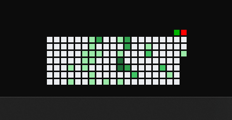

# contrib_widget

GitHub コントリビューションカレンダーを Windows デスクトップ上に常駐表示するウィジェット。

公式 GraphQL APIではなく、[HTMLページ](https://github.com/users/{username}/contributions) から `data-date` / `data-level` を取得しているためトークン不要で動作します。

## 動作環境

- Windows 10 / 11

## 使い方

1. [Releases](https://github.com/GoldenPoisonedApple/GitHubWidget/releases) から `contrib_widget.exe` と `config.txt` を取得
2. 任意のフォルダに置き上記ファイルを配置
3. `config.txt` の1行目にGithubアカウント名を記載
4. `contrib_widget.exe` を実行

### (ソースからビルドする場合)

[BUILD.md](BUILD.md) を参照のこと

## config.txt

`config.txt` は **exe と同じフォルダ** に配置してください。

| 行   | 内容           | 必須           |
| --- | ------------ | ------------ |
| 1   | GitHub ユーザー名 | 〇            |
| 2   | 表示週数 (1〜53)  | × (省略時10)    |
| 3   | ウィンドウ X座標    | × (終了時に自動保存) |
| 4   | ウィンドウ Y座標    | × (終了時に自動保存) |

## 機能

- 直近 n 週分の contribution calender表示します
- 右上緑ボタン: 手動更新、更新時は青い四角か表示されます
- 右上赤ボタン: 終了
- ドラッグでウィンドウ移動可能

## スタートアップ（推奨）

`Win + R` → `shell:startup` でスタートアップフォルダを開き、ショートカットを配置してください。

## 制限・免責

- 本ソフトウェアは一切の情報収集をいたしません。
- 本ソフトウェアの使用により発生したいかなる損害についても、一切の責任を負いません。

## ライセンス

MIT License